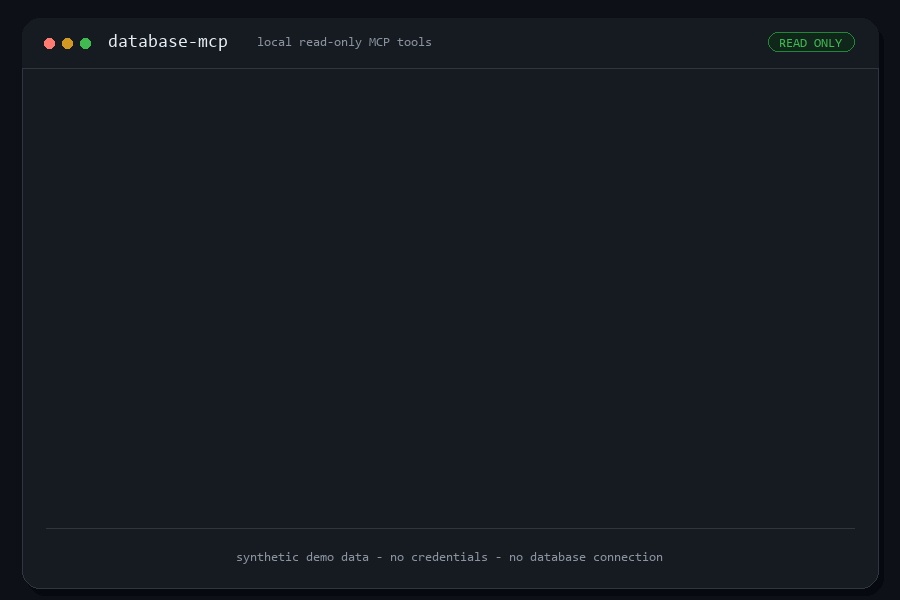

# database-mcp

A **local** MCP server that exposes a read-only SQL database to Claude Code as
native tools. One server, multiple engines — pick your database with a single
`DB_TYPE` setting:

**Oracle · PostgreSQL · MySQL/MariaDB · SQL Server · SQLite**

Built on [FastMCP](https://github.com/jlowin/fastmcp) and
[SQLAlchemy](https://www.sqlalchemy.org/). Everything runs on your machine over
stdio and query results never leave your environment. The server is
**read-only by design** and ships with no write capability, making it safe to
point at databases holding sensitive data.

## Demo

<!--
  Replace the placeholder below with a real recording.
  Suggested clip (~10–20s): ask "list tables matching INVOICE" → "describe the
  ORDERS table" → "write a read-only query for the top 10 customers" and show
  the assistant exploring the schema and returning results.
  Save it as docs/demo.gif (or .mp4) and the image below will render.
-->



> _Demo recording coming soon._

## Tools

| Tool | What it does |
|------|--------------|
| `test_connection` | Verify connectivity, report dialect + server version |
| `run_query` | Execute a single read-only `SELECT` / `WITH` query (supports bind variables) |
| `list_schemas` | List schemas visible to the account |
| `list_tables` | List tables/views, filterable by schema and name substring |
| `describe_table` | Columns, types, nullability, and primary key for a table |

Schema discovery uses SQLAlchemy's cross-dialect inspector, so the same tools
work identically across every supported database.

### Read-only guarantees

1. `run_query` accepts only a single `SELECT` / `WITH...SELECT` statement.
2. Comments and string literals are stripped before validation, so forbidden
   keywords can't be smuggled in. DML, DDL, stored-procedure calls, `FOR UPDATE`,
   and multi-statement input are all rejected.
3. Every query runs in a transaction that is always rolled back.
4. Row output is capped by `DB_MAX_ROWS` (default 100).

> **Defense in depth:** still connect with a database account that only has
> read (`SELECT`) privileges. The tool-layer checks are a safety net, not a
> substitute for least-privilege credentials.

## Setup

```powershell
cd path\to\database-mcp
uv venv
uv pip install -e .
```

Oracle and SQLite work out of the box. For other databases, install the matching
driver extra:

```powershell
uv pip install -e ".[postgresql]"   # or .[mysql], .[mssql], .[all]
```

Configure via environment variables — **never hardcoded**. Copy the example
(the `.env` file is git-ignored):

```powershell
Copy-Item .env.example .env
# then edit .env
```

Minimum: `DB_TYPE` plus connection details (`DB_HOST`, `DB_USER`,
`DB_PASSWORD`, `DB_NAME`) — or a full `DATABASE_URL`. See [.env.example](.env.example).

## Register with Claude Code

Point Claude Code at the venv's Python and pass settings via the `env` block:

```powershell
claude mcp add database --scope user `
  --env DB_TYPE=postgresql `
  --env DB_HOST=db-host.example.com `
  --env DB_USER=app_readonly `
  --env DB_PASSWORD=your_password `
  --env DB_NAME=appdb `
  --env DB_MAX_ROWS=100 `
  -- "path\to\database-mcp\.venv\Scripts\python.exe" -m database_mcp.server
```

Restart Claude Code, run `/mcp` to confirm `database` is connected, then try:
*"test the database connection"* → *"list tables matching INVOICE"*.

To work with **two databases at once** (e.g. source + target for a migration),
register the server twice under different names (`database_source`,
`database_target`) with different connection settings.

## Documentation

- **docs/CONFIGURATION.docx** — end-to-end setup, environment variables, per-database notes, Claude Code registration, multiple databases, verification, and troubleshooting.
- **docs/USE_CASES.docx** — features, tool reference, workflows (schema discovery, data mapping, writing/debugging SQL, source→target migration), example prompts, and the read-only safety model.

## Local tests (SQLite, no external DB needed)

```powershell
.venv\Scripts\python.exe smoke_test.py     # read-only validator + tool registration
.venv\Scripts\python.exe sqlite_test.py    # live round-trip against a temp SQLite DB
.venv\Scripts\python.exe handshake_test.py # full MCP stdio handshake
```

## Project layout

```
src/database_mcp/
  config.py    env-var configuration (DB_TYPE / URL building, no secrets)
  db.py        SQLAlchemy engine, query execution, cross-dialect inspection
  safety.py    read-only SQL enforcement
  server.py    FastMCP tools + entry point
docs/
  CONFIGURATION.docx
  USE_CASES.docx
```

## License

Released under the [MIT License](LICENSE).
